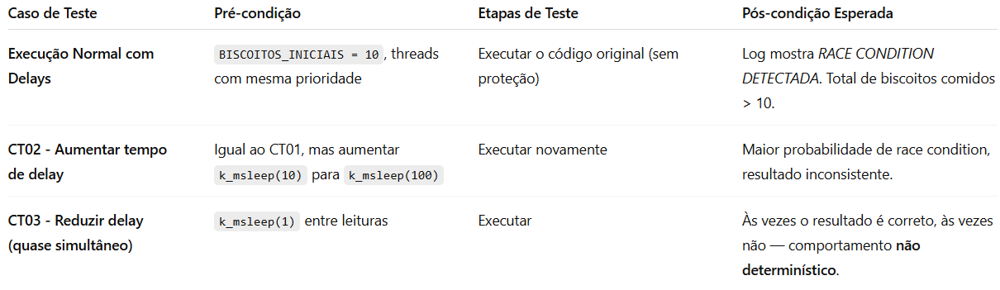
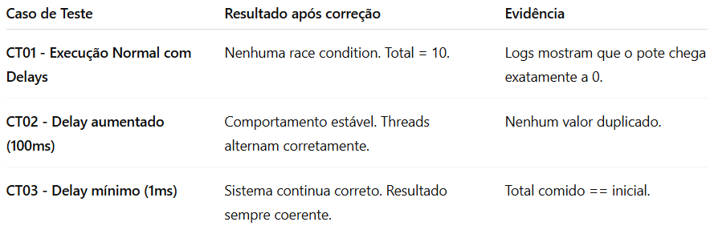

## Comentários iniciáis sobre o código do Alexander que apresenta Race Condition por Henrique Lima:
O que claramente está causando um comportamento incorreto e inesperado para o desenvolvedor é que o código cria duas threads que acessam a variável compartilhada e global, biscoitos_no_pote sem nenhum tipo de exclusão mútua, que como já sabido leva a inconsistência dos valores. Portanto, ambas as threads podem ler o mesmo valor de  biscoitos_no_pote (ex: 2), dormir (k_msleep(10)) e depois subtrair 1 de forma independente. Isso faz com que dois biscoitos “sumam” de um só valor — ou seja, o total final de biscoitos consumidos pode ser maior que o número inicial. Exemplo de saída observada: 
GUSTAVO: Peguei um biscoito. Pote tinha: 2, Agora tem: 1
VITOR: Peguei um biscoito. Pote tinha: 2, Agora tem: 1
...
RACE CONDITION DETECTADA!
Total comido (11) != Biscoitos iniciais (10)

## Momento onde o erro ocorre:
int biscoitos_restantes = biscoitos_no_pote;
k_msleep(10);
biscoitos_no_pote = biscoitos_restantes - 1;

Esse delay permite que as duas threads leiam o mesmo valor antes de atualizar o biscoitos_no_pote, portanto é uma janela crítica onde ocorre o race condition.
## Planejamento de testes antes da correção:

## Correção do código:
Afim de sanar a race condition do presente código implementei o uso de mutex para garantir a exclusão mútua na região crítica usando a API k_mutex do zephyr. O código corrigido se encontra na present branch.

## Reexecução dos casos de testes:

## Conclusão quanto ao código do Alexander:
O experimento mostrou que partilhar recursos críticos( a variável global, por exemplo) com a ausência de um mecanismo de controle no acesso leva a inconsistências, como foi demonstrado. A aplicação de mutex como mecanismo de sincronização garantiu a integridade dos dados e a previsibilidade da execução, eliminando assim, a race condition observada.

## Avaliação do colega
- Avaliação realizada por Alexander Oliveira

O código antes da correção fazia a contagem errada de uma variável pro conta de uma race condition de variaveis concorrentes de mesma prioridade. Depois da correção a partir da implementação do mutex, o código se tornou estável e deixou de fazer a contagem errada da variável, eliminando a race condition.