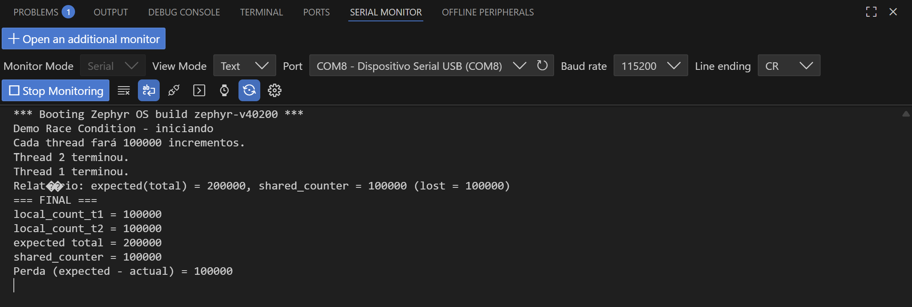
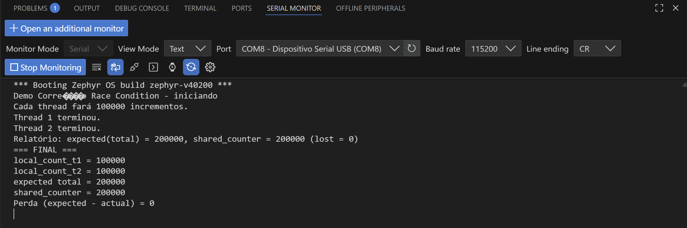

## Nome dos integrantes
- Alexander Oliveira
- Enzo Shinzato
- Henrique Lima

## Cenário Escolhido
O cenário escolhido foi o programa implementado pelo Henrique Lima.

## Casos de Teste
| Caso de Teste | Pré-condição | Etapas de Teste | Pós-condição Esperada |
|----------------|---------------|------------------|------------------------|
| 1: Concorrência Simples de Incremento (threads com mesma prioridade) | 1. Variável global shared_counter = 0. 2. Thread inc1 e inc2 criadas para rodar a função de incremento (loop de 100.000). 3. Thread report criada para imprimir o resultado. 4. O k_yield() está ativo no código. | 1. Iniciar a execução das threads inc1 e inc2 (com mesma prioridade para forçar concorrência). 2. Aguardar ambas terminem seus loops com interrupção do k_yield(). 3. Sinalizar para a thread report imprimir o valor final de shared_counter no monitor serial. | O valor esperado é de 200.000 porém devido a condição de race condition o valor obtido é de 100.000 |
| 2: Concorrência Simples de Incremento (threads com diferentes prioridades) | 1. Variável global shared_counter = 0. 2. Thread inc1(menor prioridade) e inc2(maior prioridade) criadas para rodar a função de incremento (loop de 100.000). 3. Thread report criada para imprimir o resultado. 4. O k_yield() está ativo no código. | 1. Iniciar a execução das threads inc1 e inc2 (com mesma prioridade para forçar concorrência). 2. Aguardar ambas terminem seus loops com interrupção do k_yield(). 3. Sinalizar para a thread report imprimir o valor final de shared_counter no monitor serial. | O valor esperado é de 200.000. Como não ha concorrência pela CPU as duas threads executam suas tarefas devidamente sem interrupções |
| 3: Concorrência Simples de Incremento com Mutex | 1. Variável global shared_counter = 0. 2. Thread inc1 e inc2 criadas para rodar a função de incremento (loop de 100.000). 3. Implementação do mutex nas seções crítcas das threads inc1 e inc2. 3. Thread report criada para imprimir o resultado. 4. O k_yield() está ativo no código. | 1. Iniciar a execução das threads inc1 e inc2 (com mesma prioridade para forçar concorrência). 2. Verificar a interrupção da inc2 pelo mutex. 3. Aguardar ambas terminem seus loops com interrupção do k_yield(). 4. Sinalizar para a thread report imprimir o valor final de shared_counter no monitor serial. | O valor esperado é de 200.000 |

## Descrição da Race Condition
No código fornecido pelo meu colega,  o seu programa cria 3 threads, sendo 2 responsáveis por gerenciar uma variável global, simulando uma espécie de contador, e a outra atribui-se o papel de imprimir os valores no monitor serial. O problema de race condition ocorre quando, durante a execução do contador da primeira thread, antes de atribuir o valor contado à variável global, ela é liberada para a segunda thread fazer sua contagem, assim não é somada a variável global o valor do contador da mesma, pois ao retornar a primeira thread ela subscrever o valor dela à variável global.

## Descrição da Solução
Uma possível resolução desse problema é usar um semáforo exclusivo na seção crítica do código, então quando executarmos a função da thread 1, e ela for liberada antes de atribuir o valor à variável global, a thread 2 será suspensa até a thread 1 terminar a sua execução. Assim que for concluída, o sistema operacional liberará a segunda thread que será executada, resultando, no final, o valor correto da variável global.

## Evidências
As imagens abaixo evidenciam a correção do problema.

- Race Condition: 

- Correção do Race Condition:

## Avaliação Colega - Alexander
A correção do código e os casos de testes executados pelo meu colega Alexander foram devidamente implementados e validados, solucionando o problema de race condition.
A implementação da solução proposta, que consistia no uso de um mutex (k_mutex_lock() e k_mutex_unlock()) para proteger a região crítica onde a variável shared_counter é incrementada, foi realizada de forma correta.
Para a validação, foram re-executados os três casos de teste (utilizando k_yield() e k_busy_wait()) que anteriormente expunham a falha. Conforme as evidências apresentadas, o código corrigido passou em todos os testes, atingindo a contagem final esperada, o que comprova a eficácia da correção.